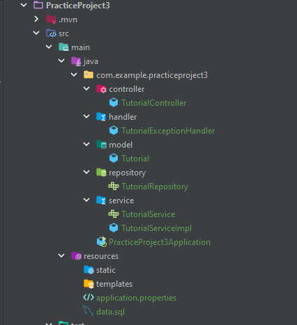
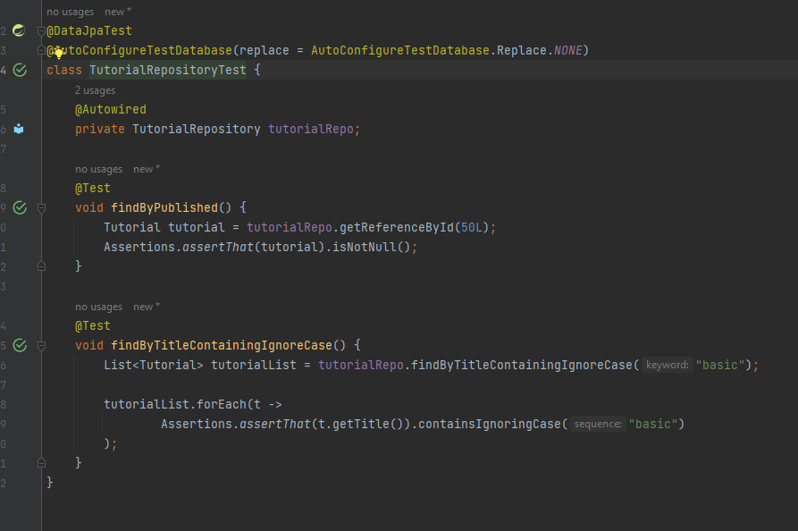
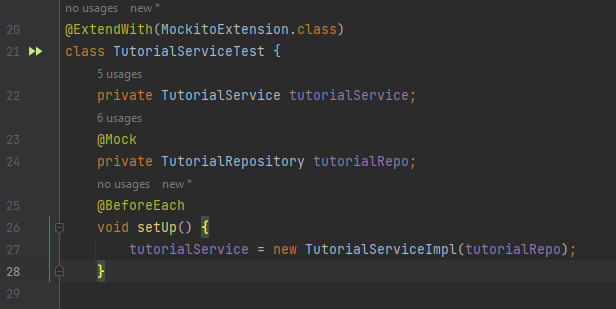
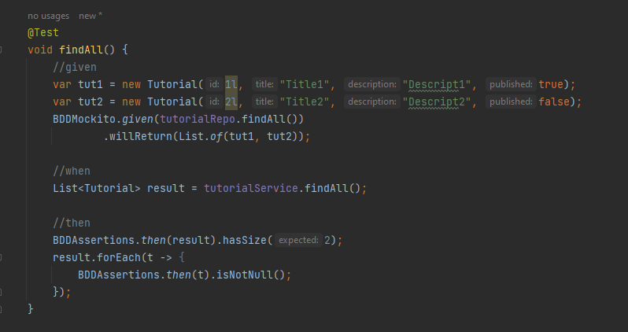
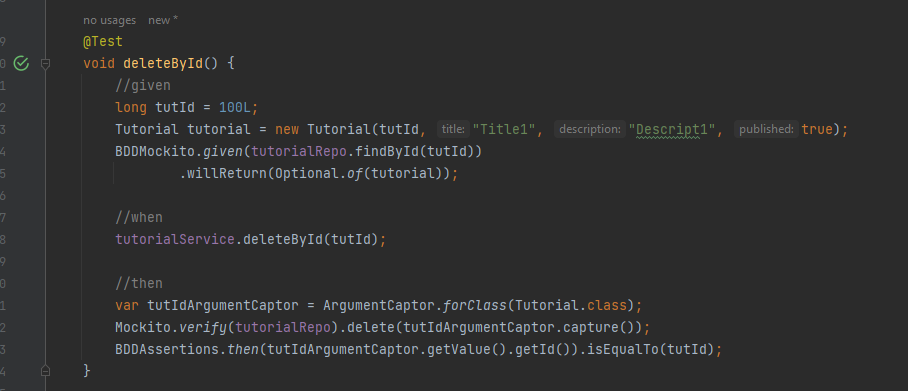
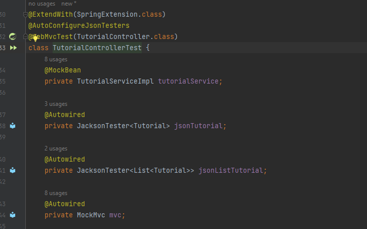
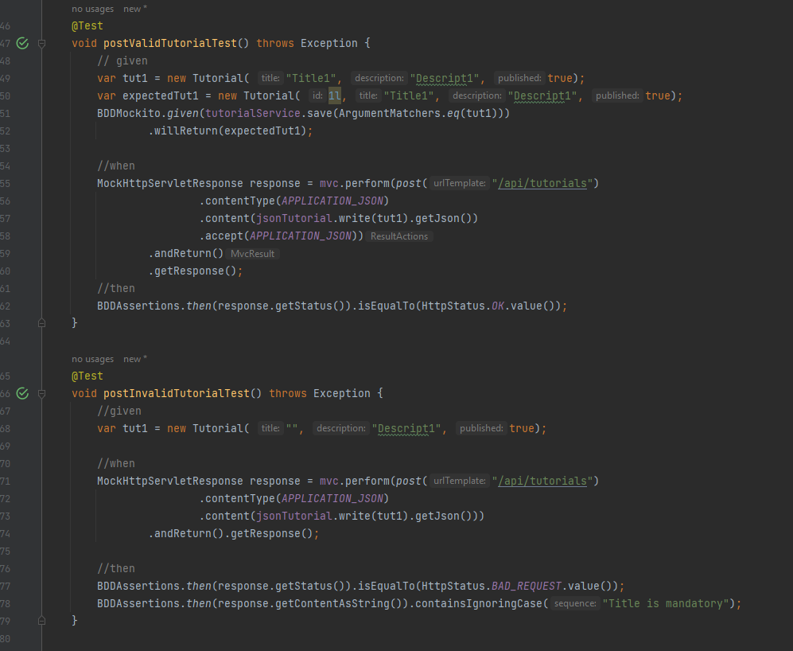
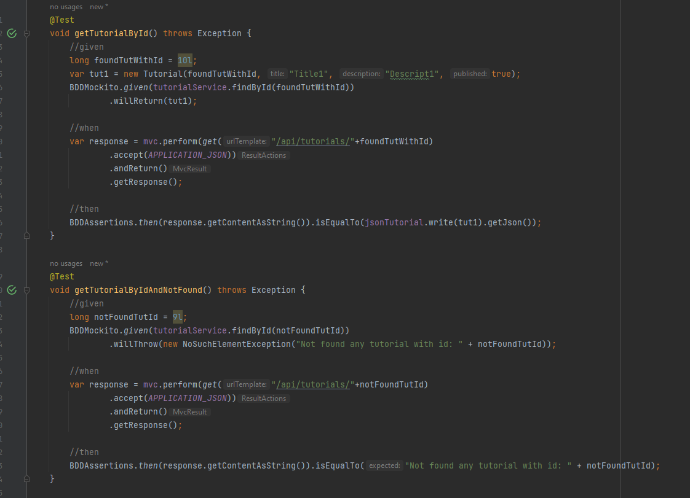
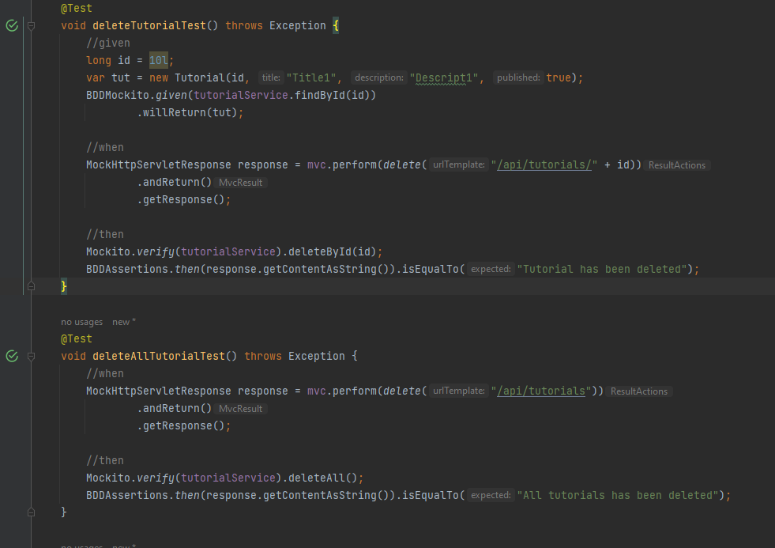
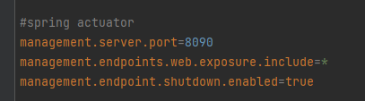

# Practice Project 3: Spring Boot Test, Actuator, DevTools

# I - Spring Boot Test

1. Task 1: Create a three layers CRUD app

    
2. Task 2: Write test case for each layer:

   1. Repository Layer:
      (using H2 database with data from data.sql)
        
   2. Service Layer:
     - Setup:
       
     - Test findAll():
        
     - Test deleteById()
        
     - Check other test case in TutorialServiceTest
    
   3. Controller Layer:
    - Setup:
        
    - Test case: POST valid and invalid entity:
        
    - Test case: GET find exist and not exist entity:
        
    - Test case: DELETE delete tutorial by id and delete all tutorial
        
    - Check other test case in TutorialControllerTest

# II - Actuator and Devtool
1. Task 1: Actuator
    - Set actuator properties:
        
    
     
